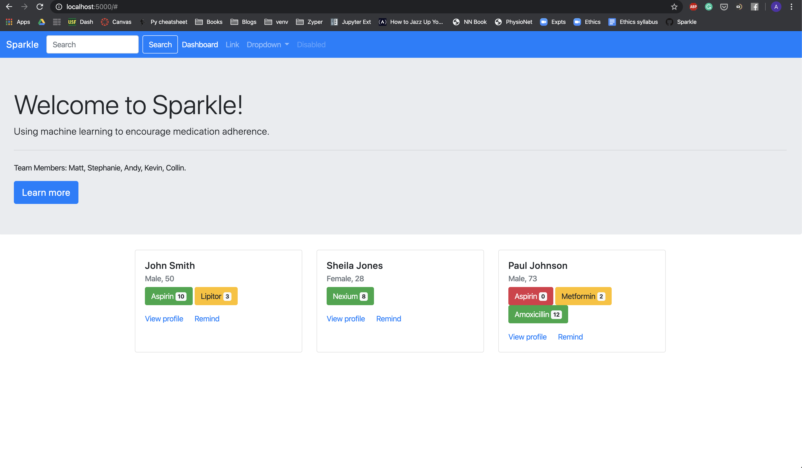

# _Sparkle_: A Multi-Platform System for Combating Medication Non-adherence with Machine Learning

#### _Team Members_:
* [Andy Cheon](https://www.linkedin.com/in/acheon/)
* [Stephanie Jung](https://www.linkedin.com/in/yeojujung/)
* [Collin Prather](https://www.linkedin.com/in/collin-prather/)
* [Matthew Sarmiento](https://www.linkedin.com/in/msarmi9/)
* [Kevin Wong](https://www.linkedin.com/in/kevinbw/)

Currently, there are a variety of mobile and smartwatch applications available that are designed to help patients take their medication correctly. These applications require patients to manually add dosage information and intake schedule for each medication, and provide automated reminders to take medication accordingly. In other words, the burden of correctly taking medication is placed entirely on the patient and there is no mechanism for verifying that a patient did indeed do so. We believe this to be a fundamental flaw and attempt to address it by integrating both patients and doctors into a single feedback loop in which:

1. Doctors upload patient medication information to an internal online portal.

2. This information is automatically propagated to a patient’s mobile device.

3. Patients receive automated alerts to take medication via mobile & smartwatch devices.

4. Correct medication intake is verified both by patient input and a ML model.

5. The doctors’ internal portal is updated with this information, allowing doctors to:

    - Take corrective action if a patient fails to take medication as prescribed.

    - Submit a prescription refill order to a patient’s pharmacy if needed.

6) Patients are alerted to pick-up medication refills at their local pharmacy or are notified that they have completed the course of treatment for the given medication.

**Our goal** is to implement this feedback loop via a multi-platform system composed of the following three components:

1. A quiet Apple Watch app that fades seamlessly into the background, notifying patients only when it is time to take their medication.

2. An accompanying iPhone app that displays a clean and minimal dashboard presenting a patient’s medication schedule for the current week.

3. An internal web app presenting doctors with a bird’s-eye-view of all of their patients.

## Components

_This project is in progress. The components mentioned will be developed in the Spring of 2020._

### WatchOS/iOS Applications

_In development on the_ [_`mobile` branch._](https://github.com/msarmi9/Sparkle/tree/mobile/mobile)

* WatchOS features:
    - start/stop button for logging sensor data (gyroscope, accelerometer, audio).
    - Configuration with remote server for automatic data transfer.
    - Push notifications in accordance with the prescription schedule set by a patient's doctor.
    - Snooze & remind-me-later buttons.

* iOS features:
    - Seamless integration with WatchOS app.
    - Clean & minimal home dashboard displaying current week’s intake schedule and history, organized by day and time (morning, afternoon, evening).
    - Separate view for weekly, monthly, and yearly medication intake summary & statistics.
    - Collection of gamification rewards (characters, planets, trees, etc.) based on successful medication adherence (e.g. streaks).

### Web Application

_In development on the_ [_`web` branch_](https://github.com/msarmi9/Sparkle/tree/web).

* features
    - Secure log-in.
    - Homepage displaying clickable cards for patients with poor medication adherence rates, which when clicked bring up a comprehensive dashboard of patient information including:
        * Illnesses & current medication, intake history, and amount of medication remaining.
        * Summary of KPIs for medication adherence (current streak; weekly, monthly and lifetime adherence rates).
    - Search bar for selecting patients by name at top of homepage.
    - Ability to upload prescription information and medication schedules for each patient.
    - Alerts (web/text/e-mail) for patients with poor medication adherence and low medication state.

_This is a screenshot of a drafted UI and is likely to change in the coming weeks._
